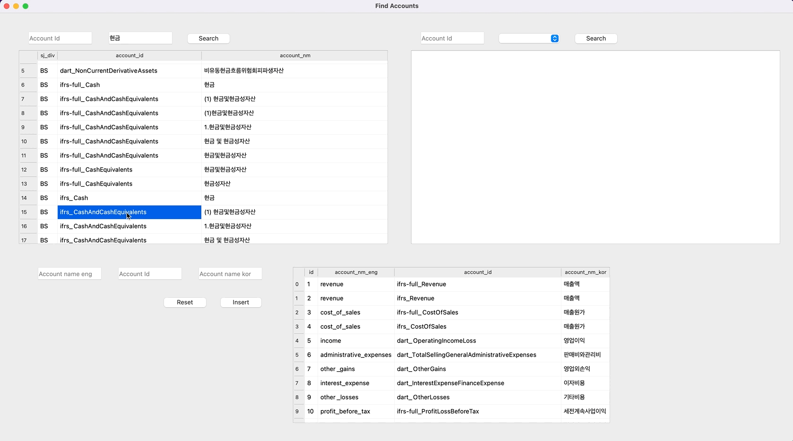

### 기업개황, 계정과목, 분기별 금액, 재무비율 데이터 모델링

---

- dart에서 가져온 재무데이터 원본에서 계정과목명 검색
    
    **(한글, 영어 둘다 가능하고 정확한 계정과목명이 아닌 키워드 검색으로도 가능)**
    
    
    

- 검색결과에서 나온 account_id를 전처리 된 테이블에서 검색
    
    
    

- 결과로 나온 금액 데이터를 FnGuide와 크로스체크 후 계정과목 테이블(`dart_accounts`)에 insert
    
    

    **[source code]** [https://github.com/yeonseo-Jung/finance_data/blob/master/gui/gui_find_account.py](https://github.com/yeonseo-Jung/finance_data/blob/master/gui/gui_find_account.py)
    

- 계정과목 테이블 활용하여 금액 테이블(`dart_amounts`) 구축
    
    **[source code]** [https://github.com/yeonseo-Jung/finance_data/blob/master/preprocessing/preprocessing_dart.py](https://github.com/yeonseo-Jung/finance_data/blob/master/preprocessing/preprocessing_dart.py)